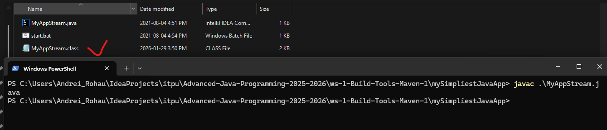
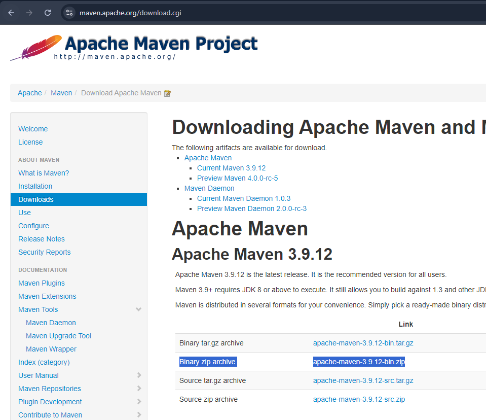
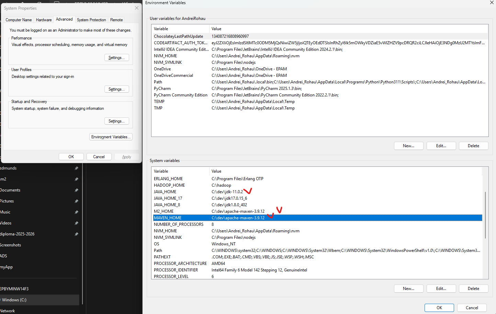
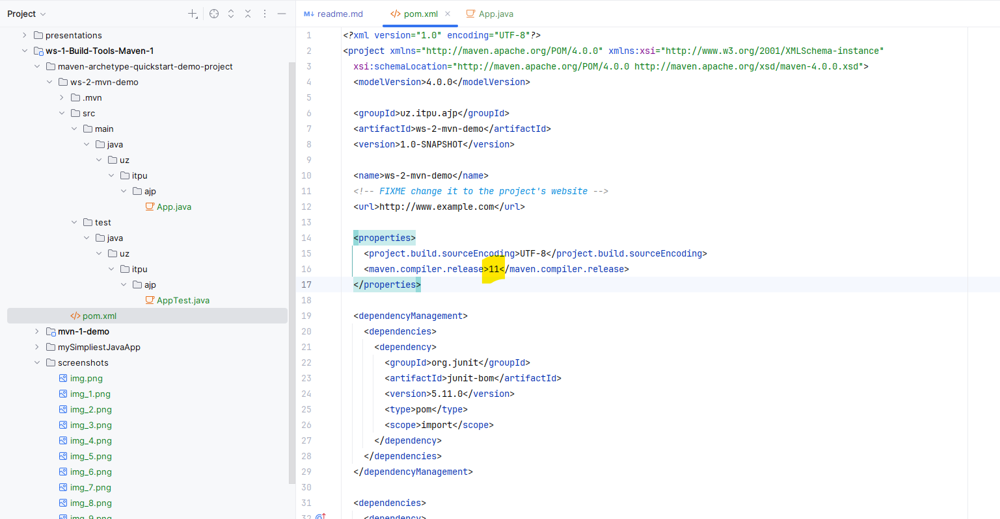
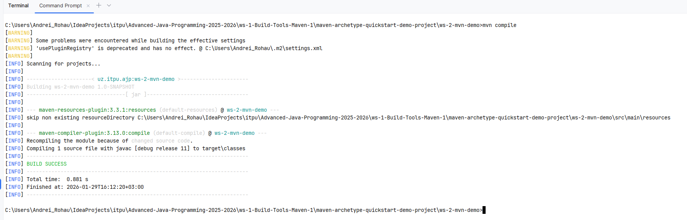
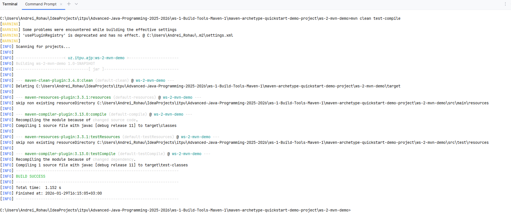
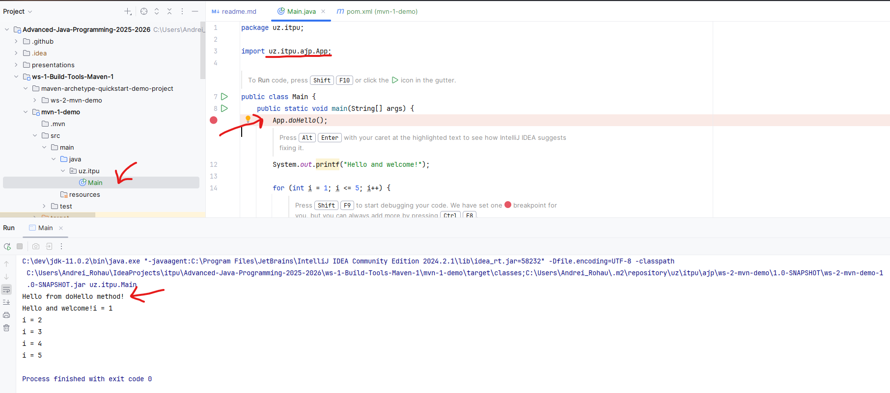

# Maven. Build Tools Concept. Maven Installation and Configuration

---

## The Concept of a Build Tool

```commandline
mvn -v
```
```commandline
mvn archetype:generate "-DarchetypeGroupId=org.apache.maven.archetypes -DarchetypeArtifactId=maven-archetype-quickstart -DarchetypeVersion=1.3"
```
```commandline
cd ./target
```
```commandline
java -jar my-app-1.0-SNAPSHOT.jar
```
```commandline
mvn compile
```
```commandline
mvn test-compile
```
```commandline
mvn clean
```
```commandline
mvn test
```
```commandline
mvn package
```
```commandline
mvn clean install
```

---

## Simpliest Java App guide (Used PowerShell on Windows)

1. Open terminal in `mySimpliestJavaApp` folder
2. Run command to build the app:
```commandline
java --version
```


3. Compile class:
```commandline
 javac .\MyAppStream.java
```



4. Run the app:
```commandline
 java MyAppStream
```


5. Clean up the folder by deleting the generated `.class` file
```commandline
del MyAppStream.class
```


---

## workshop guide

1. Install Maven Binary zip archive	apache-maven-3.9.12-bin.zip 
on your local machine from [https://maven.apache.org/download.cgi](https://maven.apache.org/download.cgi)




2. Unzip the archive to a folder of your choice, e.g. `C:\dev\apache-maven-3.9.12` (no spaces in path!)


3. Set the `MAVEN_HOME` environment variable to point to your Maven installation folder, e.g. `C:\dev\apache-maven-3.9.12`




4. Set the `PATH` environment variable to include the `bin` folder of your Maven installation, e.g. `%MAVEN_HOME%\bin`


5. Check `JAVA_HOME` environment variable is set and points to your JDK installation folder, e.g. `C:\dev\jdk-11`


6. Open a new command prompt and run `mvn -v` to verify Maven is installed correctly


7. Navigate to `maven-archetype-quickstart-demo-project` in terminal


8. Run prepare an archetype project command, set required parameters:
```commandline
mvn archetype:generate "-DarchetypeGroupId=org.apache.maven.archetypes -DarchetypeArtifactId=maven-archetype-quickstart -DarchetypeVersion=1.3"
```


9. Now notice created project with files, navifate to java class and add a custom method.


10. Setup JDK verion in POM.xml file according to your JDK version




11. Compile source classes the project using maven:
```commandline
mvn compile
```




12.  Clean target and compile test classes:
```commandline
mvn clean test-compile
```




13. Run tests:
```commandline
mvn clean test
```


14. Clean and package the project with as JAR file:
```commandline
mvn clean package
```


15. Notice structure of compiled project in `target` folder


16. Let's install into a local Maven repository on your PC:
```commandline
mvn clean install
```


17. Now let's reuse our installed artifact in another project `mvn-1-demo` in Intellij Idea. (Update/refresh Maven dependencies!)
Add dependency to POM.xml file:
```xml
<dependency>
    <groupId>uz.itpu.ajp</groupId>
    <artifactId>ws-2-mvn-demo</artifactId>
    <version>1.0-SNAPSHOT</version>
</dependency>
```


18. Add code to use the dependency in `App.java` file:


19. Run the `mvn-1-demo` project and notice the output:

